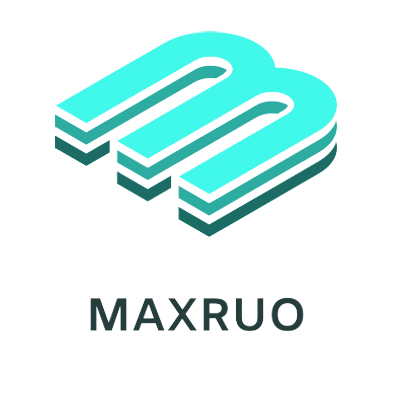
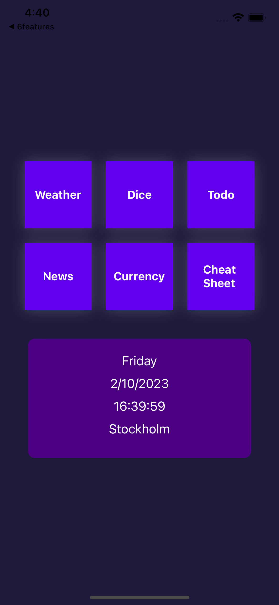
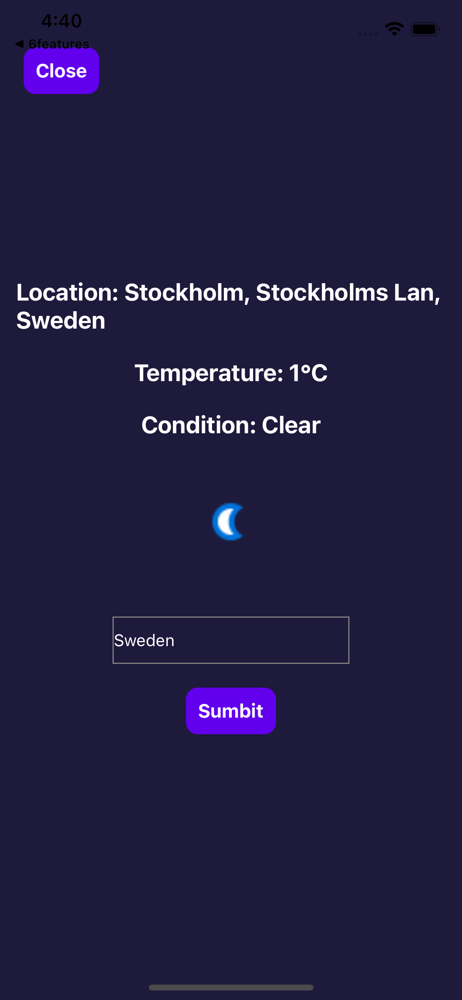
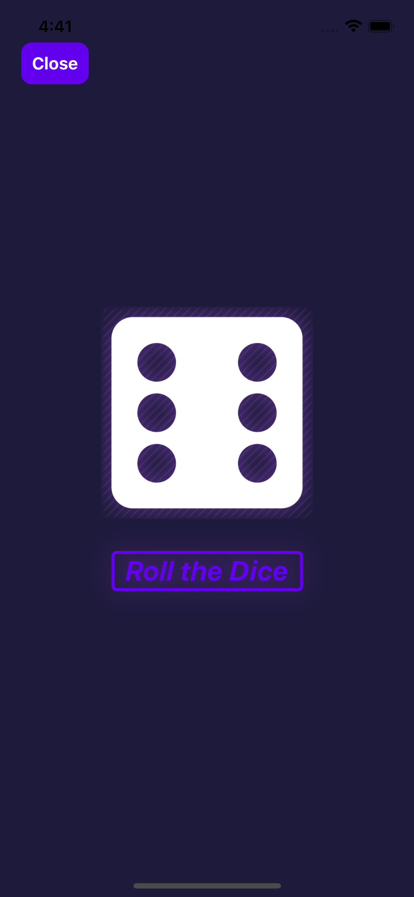
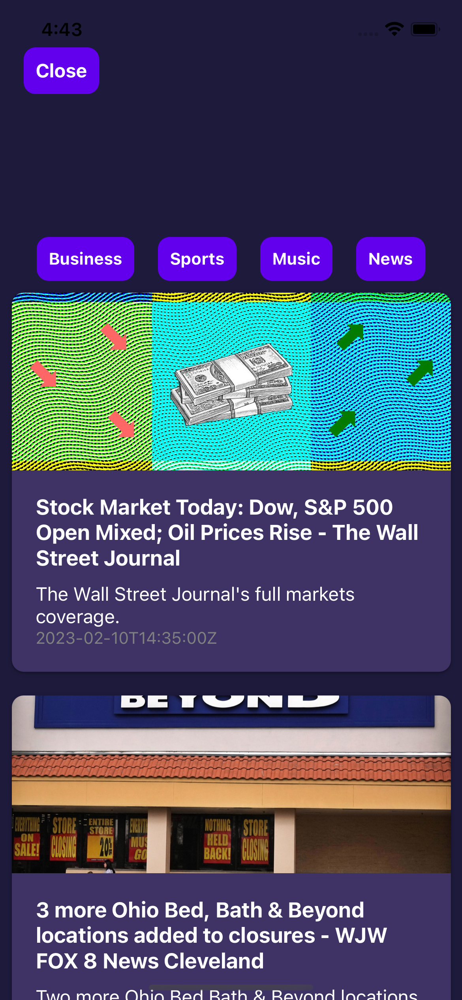
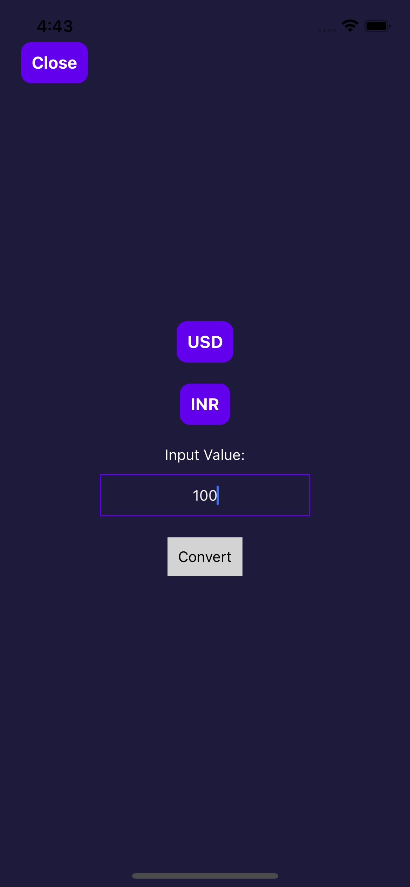
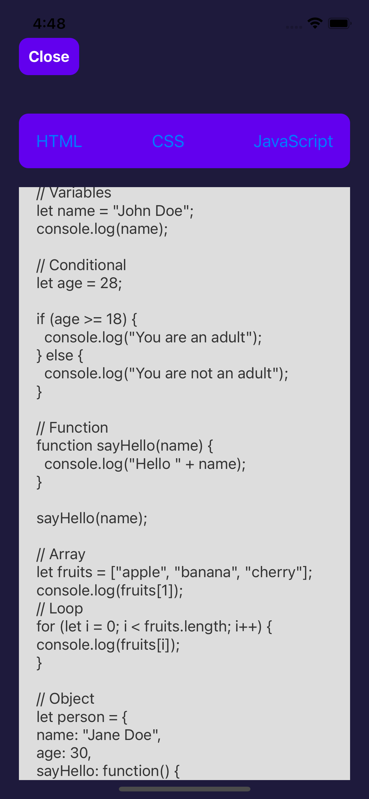

[![Contributors][contributors-shield]][contributors-url]
[![Forks][forks-shield]][forks-url]
[![Stargazers][stars-shield]][stars-url]
[![Issues][issues-shield]][issues-url]
[![MIT License][license-shield]][license-url]
[![LinkedIn][linkedin-shield]][linkedin-url]

<!-- PROJECT LOGO -->
 

  

<h3 align="center">6 Feature react native app</h3>

<!-- TABLE OF CONTENTS -->

  
Table of Contents

  <ol>
    <li>
      <a href="#about-the-project">About The Project</a>
      <ul>
        <li><a href="#built-with">Built With</a></li>
      </ul>
    </li>
    <li><a href="#usage">Usage</a></li>
      <li><a href="#screenshots">Screenshots</a></li>
    <li><a href="#contact">Contact</a></li>
    
 
  </ol>

<!-- ABOUT THE PROJECT -->
## About The Project

The website is responsive and has both the looks and the design.

(<a href="#readme-top">back to top</a>)

## Built With

This project is built with react native

  

(<a href="#readme-top">back to top</a>)

<!-- USAGE EXAMPLES -->
## Usage

This app has 6 different features and can be run on android, ios and web.

<!-- Screenshots -->
## Screenshots
<h2>Home </h2>

The home page with 6 buttons to each feature 

<h2>Weather </h2>

The Weather page that displays the weather and you can choose which location 

<h2>Dice </h2>

The Dice page that has a dice that randomizes a number from 1-6 and shows it in a dice face 

<h2>Todo </h2>

A todo app where you can create Todo notes and delete them 

<h2>news </h2>

A news page where it fetches news from an api and you can choose news categories 

<h2>Currency </h2>

A currency converter 

<h2>Cheat Sheet </h2>

A cheat sheet page where you can see cheat sheets for html, css and javascript

<!-- LICENSE -->
## License

Distributed under the MIT License. See `LICENSE.txt` for more information.

(<a href="#readme-top">back to top</a>)

(<a href="#readme-top">back to top</a>)

<!-- MARKDOWN LINKS & IMAGES -->
<!-- https://www.markdownguide.org/basic-syntax/#reference-style-links -->
[contributors-shield]: https://img.shields.io/github/contributors/MaxRuotsalainen/6features.svg?style=for-the-badge
[contributors-url]: https://github.com/MaxRuotsalainen/6features/graphs/contributors
[forks-shield]: https://img.shields.io/github/forks/MaxRuotsalainen/6features.svg?style=for-the-badge
[forks-url]: https://github.com/MaxRuotsalainen/6features/network/members
[stars-shield]: https://img.shields.io/github/stars/MaxRuotsalainen/6features.svg?style=for-the-badge
[stars-url]: https://github.com/MaxRuotsalainen/6features/stargazers
[issues-shield]: https://img.shields.io/github/issues/MaxRuotsalainen/6features.svg?style=for-the-badge
[issues-url]: https://github.com/MaxRuotsalainen/6features/issues
[license-shield]: https://img.shields.io/github/license/MaxRuotsalainen/6features.svg?style=for-the-badge
[license-url]: https://github.com/MaxRuotsalainen/6features/blob/master/LICENSE.txt
[linkedin-shield]: https://img.shields.io/badge/-LinkedIn-black.svg?style=for-the-badge&logo=linkedin&colorB=555
[linkedin-url]: https://linkedin.com/in/linkedin_username
[product-screenshot]: images/screenshot.png
[Next.js]: https://img.shields.io/badge/next.js-000000?style=for-the-badge&logo=nextdotjs&logoColor=white
[Next-url]: https://nextjs.org/
[React.js]: https://img.shields.io/badge/React-20232A?style=for-the-badge&logo=react&logoColor=61DAFB
[React-url]: https://reactjs.org/
[Vue.js]: https://img.shields.io/badge/Vue.js-35495E?style=for-the-badge&logo=vuedotjs&logoColor=4FC08D
[Vue-url]: https://vuejs.org/
[Angular.io]: https://img.shields.io/badge/Angular-DD0031?style=for-the-badge&logo=angular&logoColor=white
[Angular-url]: https://angular.io/
[Svelte.dev]: https://img.shields.io/badge/Svelte-4A4A55?style=for-the-badge&logo=svelte&logoColor=FF3E00
[Svelte-url]: https://svelte.dev/
[Laravel.com]: https://img.shields.io/badge/Laravel-FF2D20?style=for-the-badge&logo=laravel&logoColor=white
[Laravel-url]: https://laravel.com
[Bootstrap.com]: https://img.shields.io/badge/Bootstrap-563D7C?style=for-the-badge&logo=bootstrap&logoColor=white
[Bootstrap-url]: https://getbootstrap.com
[JQuery.com]: https://img.shields.io/badge/jQuery-0769AD?style=for-the-badge&logo=jquery&logoColor=white
[JQuery-url]: https://jquery.com 
[Html5]: https://img.shields.io/badge/HTML5-E34F26?style=for-the-badge&logo=html5&logoColor=white
[Html5-url]: https://www.w3schools.com/html/html_intro.asp
[Css3]: https://img.shields.io/badge/CSS3-1572B6?style=for-the-badge&logo=css3&logoColor=white
[Css3-url]: https://developer.mozilla.org/en-US/docs/Web/CSS
[Javascript]: https://img.shields.io/badge/JavaScript-323330?style=for-the-badge&logo=javascript&logoColor=F7DF1E
[Javascript-url]: https://www.javascript.com/